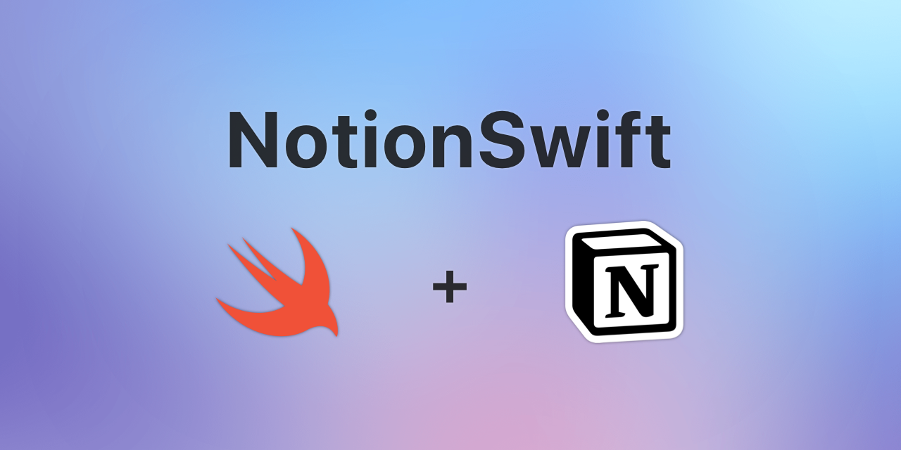

# NotionSwift

Unofficial [Notion](https://www.notion.so) SDK for iOS & macOS. 

This is still work in progress version, the module interface might change.

## API Documentation

This library is a client for the official Notion API. 
For more details and documentation please check [Notion Developer Portal](https://developers.notion.com/)

## Installation

### CocoaPods

```ruby
pod 'NotionSwift', '0.7.1'
```

### Swift Package Manager

```swift
dependencies: [
    .package(url: "https://github.com/chojnac/NotionSwift.git", .upToNextMajor(from: "0.7.1"))
]
```

## Usage

Currently, this library supports only the "internal integration" authorization mode. For more information about authorization and 
instruction how to obtain `NOTION_TOKEN` please check [Notion Offical Documentation](https://developers.notion.com/docs/authorization).

**Important:** Integrations are granted access to resources (pages and databases) which users have shared with the integration. Resources that are not shared with the integration are not visible by API endpoints. 

### Creating a Notion client.

```swift

let notion = NotionClient(accessKeyProvider: StringAccessKeyProvider(accessKey: "{NOTION_TOKEN}"))

```

### List all databases

The `https://api.notion.com/v1/databases` is deprecated. To recommended way to list all databases is to use `https://api.notion.com/v1/search` endpoint. 
In theory, search allows filtering results by object type. However, currently, the only filter allowed is `object` which will filter by type of object (either `page` or `database`)
To narrow search results,  use code snippet belove. 

```swift
// fetch avaiable databases
notion.search(request: .init(filter: .database)) { result in
    let databases = result.map { objects in
        objects.results.compactMap({ object -> Database? in
            if case .database(let db) = object {
                return db
            }
            return nil
        })
    }
    print(databases)
}
```

### Query a database

In this example we will get all pages in the database. To narrow results use `params` argument.
```swift
let databaseId = Database.Identifier("{DATABASE UUIDv4}")

notion.databaseQuery(databaseId: databaseId) {
    print($0)
}
```

### Retrieve a database

```swift
let databaseId = Database.Identifier("{DATABASE UUIDv4}")

notion.database(databaseId: databaseId) {
    print($0)
}
```

### Create a database

```swift
let parentPageId = Page.Identifier("e67db074-973a-4ddb-b397-66d3c75f9ec9")

let request = DatabaseCreateRequest(
    parent: .pageId(parentPageId),
    icon: .emoji("🤔"),
    cover: .external(url: "https://images.unsplash.com/photo-1606787366850-de6330128bfc"),
    title: [
        .init(string: "Created at: \(Date())")
    ],
    properties: [
        "Field 10": .richText
    ]
)

notion.databaseCreate(request: request) {
    print($0)
}
```

### Update a database

```swift
let id = Database.Identifier("{DATABASE UUIDv4}")

// update cover, icon & add a new field
let request = DatabaseUpdateRequest(
    title: nil,
    icon: .emoji("🤔"),
    cover: .external(url: "https://images.unsplash.com/photo-1606787366850-de6330128bfc"),
    properties: [
        "Field 10": .richText
    ]
)

notion.databaseUpdate(databaseId: id, request: request) {
    print($0)
}
```

### Retrieve a page

Retrieve page properties. 

```swift
let pageId = Page.Identifier("{PAGE UUIDv4}")

notion.page(pageId: pageId) {
    print($0)
}
```

Page content (text for example) is represented as an array of blocks. The example below loads properties and page content. 

```swift
let pageId = Page.Identifier("{PAGE UUIDv4}")

notion.page(pageId: pageId) { [notion] in
    print("---- Properties ----- ")
    print($0)
    switch $0 {
    case .success(let page):
        notion.blockChildren(blockId: page.id.toBlockIdentifier) {
            print("---- Children ----- ")
            print($0)
        }
    default:
        break
    }
}
```
**Note:** The API returns only the direct children of the page. If there is content nested in the block (nested lists for example) it requires other calls. 

### Create a page

```swift
let parentPageId = Page.Identifier("{PAGE UUIDv4}")

let request = PageCreateRequest(
    parent: .page(parentPageId),
    properties: [
        "title": .init(
            type: .title([
                .init(string: "Lorem ipsum \(Date())")
            ])
        )
    ]
)

notion.pageCreate(request: request) {
    print($0)
}
```

### Update page properties

```swift
let pageId = Page.Identifier("{PAGE UUIDv4}")

// update title property
let request = PageProperiesUpdateRequest(
    properties: [
        .name("title"): .init(
            type: .title([
                .init(string: "Updated at: \(Date())")
            ])
        )
    ]
)

notion.pageUpdateProperties(pageId: pageId, request: request) {
    print($0)
}
```

### Retrieve block children

Note: This endpoint returns only the first level of children, so for example, nested list items won't be returned. In that case, you need to make another request with the block id of the parent block.

```swift

let pageId = Block.Identifier("{PAGE UUIDv4}")

notion.blockChildren(blockId: pageId) {
    print($0)
}

```

### Append block children

```swift
let pageId = Block.Identifier("{PAGE UUIDv4}")

// append paragraph with styled text to a page.
let blocks: [WriteBlock] = [
    .heading1(["Heading 1"], color: .orange),
    .paragraph([
        "Lorem ipsum dolor sit amet, ",
        .init(string: "consectetur", annotations: .bold),
        " adipiscing elit."
    ]),
    .heading2(["Heading 2"], color: .orangeBackground),
    .columnList(columns: [
        .column([
            .paragraph(["Column 1"])
        ]),
        .column([
            .paragraph(["Column 2"])
        ])
    ]),
    try! .table(
        width: 2,
        headers: [
            ["Header 1"], ["Header 2"]
        ],
        rows: [
            .row(
                header: ["Row 1 header"],
                cells: [
                    ["Cell 1-1"], ["Cell 1-2"]
                ]
            ),
            .row(
                cells: [
                    ["Cell 2-1"], ["Cell 2-2"]
                ]
            )
        ]
    )
]
notion.blockAppend(blockId: pageId, children: blocks) {
    print($0)
}
```

### Update a block

```swift
let blockId = Block.Identifier("{BLOCK UUIDv4}")
let text: [RichText] = [
    "Current time: ",
    .init(string: Date().description, annotations: .bold)
]
let block = UpdateBlock(value: .paragraph(text: text))
notion.blockUpdate(blockId: blockId, value: block) {
    print("Updated: ", $0)
}
```

### Block delete

```swift
let blockId = Block.Identifier("{BLOCK UUIDv4}")

notion.blockDelete(blockId: block.id) {
    print("Delete: ", $0)
}
```

### Retrieve a user

```swift
let id = User.Identifier("{USER UUIDv4}")
notion.user(userId: id) {
    print($0)
}
```

### List all users
```swift
notion.usersList() {
    print($0)
}
```

### Search

Search for pages & databases with a title containing text "Lorem"
```swift
notion.search(
    request: .init(
        query: "Lorem"
    )
) {
    print($0)
}
```

Search for all databases and ignore pages.
```swift
notion.search(
    request: .init(
        filter: .database
    )
) {
    print($0)
}
```

Get all pages & databases
```swift
notion.search() {
    print($0)
}
```

### Logging and debugging

`NotionSwift` provide an internal rudimental logging system to track HTTP traffic. 
To enable it you need to set a build-in or custom logger handler and decide about log level (`.info` by default).
With `.track` log level you can see all content of a request. This is useful to track mapping issues between library data models and API.


Example logging configuration:
```swift
// This code should be in the ApplicationDelegate

NotionSwiftEnvironment.logHandler = NotionSwift.PrintLogHandler() // uses print command
NotionSwiftEnvironment.logLevel = .trace // show me everything

```

## License

**NotionSwift** is available under the MIT license. See the [LICENSE](https://github.com/chojnac/NotionSwift/blob/master/LICENSE) file for more info.
